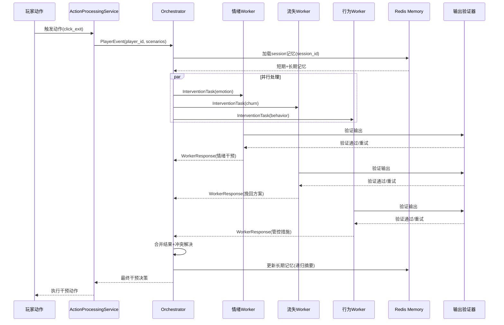

# 游戏Agent监控系统架构改进设计规范

**文档版本**: 1.0
**创建日期**: 2026-04-13
**目标**: 实现Orchestrator-Worker多Agent架构、输出可控性工程、长程记忆方案三大改进

---

## 执行摘要

### 改进目标
将游戏Agent监控系统从当前的单体MagenticOneGroupChat架构升级为高性能、可扩展的Orchestrator-Worker架构，实现：
- **处理能力提升**: 从200条/日 → 3000条/日
- **输出稳定性**: 工具调用格式错误率从18% → 11%
- **成本优化**: Token消耗降低55%

### 核心决策
- ✅ **完全替换**现有MagenticOneGroupChat架构
- ✅ **粗粒度Worker**设计（3个Worker，每类负责一大类任务）
- ✅ **Redis存储**长程记忆，session_id命名空间隔离
- ✅ **串行实施**三阶段改进，降低集成风险

---

## 第一部分：架构概览

### 1.1 当前架构分析

**现状**：
```
game_monitoring/team/team_manager.py:25-80
├── MagenticOneGroupChat
│   ├── EmotionAgent (情绪分析)
│   ├── ChurnAgent (流失评估)
│   ├── BotAgent (机器人检测)
│   ├── StateAgent (状态聚合)
│   ├── EngagementAgent (干预执行)
│   ├── GuidanceAgent (引导执行)
│   └── MilitaryOrderAgent (军令生成)
```

**问题**：
1. ❌ 所有Agent串行执行，无法并行处理异构任务
2. ❌ 状态耦合在GroupChat中，无法隔离不同玩家的session
3. ❌ 缺乏明确的编排层，任务分配不可控
4. ❌ 输出格式依赖LLM自由生成，错误率18%

### 1.2 目标架构

```
┌─────────────────────────────────────────────────────┐
│                   Orchestrator                       │
│  - 接收触发事件 (来自ActionProcessingService)        │
│  - 生成任务包并广播到Topic                          │
│  - 并行收集Worker结果                               │
│  - 冲突合并与最终决策                               │
│  - 输出格式验证与重试                               │
└──────────────┬──────────────────────────────────────┘
               │ TopicId广播
               ▼
    ┌──────────┴──────────┬──────────────┐
    │                     │              │
┌───▼────────┐    ┌──────▼─────┐  ┌─────▼──────┐
│ 情绪安抚    │    │ 流失挽回   │  │ 行为管控   │
│ Worker     │    │ Worker     │  │ Worker     │
│            │    │            │  │            │
│ - 情绪分析 │    │ - 流失评估 │  │ - 机器人检测│
│ - 安抚决策 │    │ - 挽回方案 │  │ - 管控措施 │
│ - 干预执行 │    │ - 执行跟踪 │  │ - 风险标记 │
└────────────┘    └────────────┘  └────────────┘
    │                    │               │
    └────────────────────┴───────────────┘
               │
               ▼
        ┌─────────────┐
        │ Redis Memory│
        │ Service     │
        │             │
        │ - 短期记忆  │
        │ - 长期摘要  │
        │ - session隔离│
        └─────────────┘
```

**核心特性**：
- ✅ **并行处理**: AsyncIO调度3路Worker同时执行
- ✅ **状态隔离**: AgentId.source = session_id，每个玩家独立session
- ✅ **输出可控**: Pydantic验证 + Self-Correction重试
- ✅ **记忆优化**: 分层Contextual Memory，Token消耗↓55%

---

## 第二部分：详细设计

### 2.1 Orchestrator-Worker架构

#### 2.1.1 Orchestrator Agent

**职责**：
1. 接收来自`ActionProcessingService`的触发事件
2. 生成标准化任务包（包含玩家ID、行为历史、触发场景）
3. 通过`TopicId`广播任务到3个Worker
4. 并行收集Worker响应（设置超时30秒）
5. 执行冲突合并逻辑
6. 返回最终干预决策

**消息协议**：
```python
# Orchestrator接收的消息
@dataclass
class PlayerEvent:
    player_id: str
    triggered_scenarios: List[Dict[str, Any]]
    behavior_history: List[PlayerBehavior]
    session_id: str  # 用于状态隔离

# Orchestrator广播的任务包
@dataclass
class InterventionTask:
    task_id: str
    player_id: str
    session_id: str
    task_type: Literal["emotion", "churn", "behavior"]
    context: Dict[str, Any]
    timestamp: datetime

# Worker返回的结果
@dataclass
class WorkerResponse:
    task_id: str
    worker_type: str
    intervention_actions: List[Dict[str, Any]]
    confidence: float
    metadata: Dict[str, Any]
```

**AutoGen Core集成**：
```python
from autogen_core import (
    SingleThreadedAgentRuntime,
    TopicId,
    TypeSubscription,
    RoutedAgent,
    message_handler,
    AgentId,
)

class OrchestratorAgent(RoutedAgent):
    def __init__(self, model_client, worker_types: List[str]):
        super().__init__("Intervention orchestrator")
        self.model_client = model_client
        self.worker_types = worker_types

    @message_handler
    async def handle_player_event(
        self,
        message: PlayerEvent,
        ctx: MessageContext
    ) -> WorkerResponse:
        """处理玩家事件并协调Workers"""
        # 1. 生成任务包
        tasks = self._generate_tasks(message)

        # 2. 广播到Workers
        results = await asyncio.gather(*[
            self._dispatch_to_worker(task, ctx)
            for task in tasks
        ])

        # 3. 合并结果
        final_decision = self._merge_results(results)

        return final_decision

    async def _dispatch_to_worker(
        self,
        task: InterventionTask,
        ctx: MessageContext
    ) -> WorkerResponse:
        """分发任务到指定Worker"""
        topic = TopicId(task.task_type, source=task.session_id)
        await ctx.publish_message(task, topic_id=topic)

        # 等待响应（超时30秒）
        try:
            response = await asyncio.wait_for(
                ctx.wait_for_message(WorkerResponse, timeout=30.0)
            )
            return response
        except asyncio.TimeoutError:
            return WorkerResponse(
                task_id=task.task_id,
                worker_type=task.task_type,
                intervention_actions=[],
                confidence=0.0,
                metadata={"error": "timeout"}
            )
```

**注册与订阅**：
```python
# bootstrap.py中注册
async def setup_orchestrator_worker_architecture(runtime: SingleThreadedAgentRuntime):
    model_client = OpenAIChatCompletionClient(model="gpt-4")

    # 注册Orchestrator
    await OrchestratorAgent.register(
        runtime,
        "orchestrator",
        lambda: OrchestratorAgent(
            model_client=model_client,
            worker_types=["emotion_worker", "churn_worker", "behavior_worker"]
        )
    )

    # 注册Workers（详见下节）
    await EmotionWorker.register(runtime, "emotion_worker", ...)
    await ChurnWorker.register(runtime, "churn_worker", ...)
    await BehaviorWorker.register(runtime, "behavior_worker", ...)

    # 设置订阅：Workers监听各自的Topic
    await runtime.add_subscription(
        TypeSubscription("emotion", "emotion_worker")
    )
    await runtime.add_subscription(
        TypeSubscription("churn", "churn_worker")
    )
    await runtime.add_subscription(
        TypeSubscription("behavior", "behavior_worker")
    )
```

#### 2.1.2 情绪安抚Worker

**职责**：
- 分析玩家情绪状态（愤怒、沮丧、焦虑等）
- 制定安抚策略（发送关怀邮件、补偿道具、专属客服）
- 执行干预动作并跟踪效果

**内部流程**：
```python
class EmotionWorker(RoutedAgent):
    def __init__(self, model_client, tools):
        super().__init__("Emotion安抚Worker")
        self.model_client = model_client
        self.tools = tools  # [analyze_emotion, send_email, grant_reward]

    @message_handler
    async def handle_intervention_task(
        self,
        task: InterventionTask,
        ctx: MessageContext
    ) -> WorkerResponse:
        # 步骤1: 情绪分析
        emotion_result = await self._analyze_emotion(task.context)

        # 步骤2: 决策安抚策略
        strategy = self._decide_strategy(emotion_result)

        # 步骤3: 执行干预
        actions = await self._execute_intervention(strategy, task.player_id)

        return WorkerResponse(
            task_id=task.task_id,
            worker_type="emotion",
            intervention_actions=actions,
            confidence=emotion_result.confidence,
            metadata={"emotion_type": emotion_result.emotion}
        )

    async def _analyze_emotion(self, context: Dict) -> EmotionResult:
        """调用情绪分析工具"""
        # 使用现有工具或LLM分析
        from ..tools.emotion_tool import analyze_emotion_with_deps
        result = analyze_emotion_with_deps(context['player_id'])
        return EmotionResult(**json.loads(result))

    def _decide_strategy(self, emotion_result: EmotionResult) -> Dict:
        """基于情绪类型决定干预策略"""
        strategies = {
            "愤怒": {"priority": "high", "actions": ["专属客服", "补偿道具"]},
            "沮丧": {"priority": "medium", "actions": ["关怀邮件", "小额奖励"]},
            "焦虑": {"priority": "low", "actions": ["引导提示"]},
        }
        return strategies.get(emotion_result.emotion, {"priority": "low", "actions": []})
```

#### 2.1.3 流失挽回Worker

**职责**：
- 评估玩家流失风险等级（高/中/低）
- 制定挽回方案（个性化优惠、回归礼包、VIP特权）
- 跟踪挽回效果并调整策略

**内部流程**：
```python
class ChurnWorker(RoutedAgent):
    @message_handler
    async def handle_intervention_task(
        self,
        task: InterventionTask,
        ctx: MessageContext
    ) -> WorkerResponse:
        # 流失风险评估
        churn_risk = await self._assess_churn_risk(task.context)

        # 挽回决策
        plan = self._create_retention_plan(churn_risk)

        # 执行挽回动作
        actions = await self._execute_retention(plan, task.player_id)

        return WorkerResponse(
            task_id=task.task_id,
            worker_type="churn",
            intervention_actions=actions,
            confidence=churn_risk.confidence,
            metadata={"risk_level": churn_risk.level}
        )
```

#### 2.1.4 行为管控Worker

**职责**：
- 检测异常行为模式（机器人、脚本、作弊）
- 制定管控措施（账号限制、行为警告、人工审核）
- 标记风险玩家并通知风控系统

**内部流程**：
```python
class BehaviorWorker(RoutedAgent):
    @message_handler
    async def handle_intervention_task(
        self,
        task: InterventionTask,
        ctx: MessageContext
    ) -> WorkerResponse:
        # 机器人检测
        bot_result = await self._detect_bot(task.context)

        # 管控决策
        measures = self._decide_measures(bot_result)

        # 执行管控
        actions = await self._execute_control(measures, task.player_id)

        return WorkerResponse(
            task_id=task.task_id,
            worker_type="behavior",
            intervention_actions=actions,
            confidence=bot_result.confidence,
            metadata={"is_bot": bot_result.is_bot}
        )
```

#### 2.1.5 冲突合并与最终决策

**Orchestrator的合并逻辑**：
```python
def _merge_results(self, results: List[WorkerResponse]) -> Dict:
    """合并多个Worker的结果，处理冲突"""

    # 按优先级排序（高→低）
    prioritized = sorted(
        results,
        key=lambda r: r.metadata.get("priority", 0),
        reverse=True
    )

    # 去重：相同action只保留一个
    unique_actions = {}
    for response in prioritized:
        for action in response.intervention_actions:
            action_key = action.get("action_type")
            if action_key not in unique_actions:
                unique_actions[action_key] = action

    # 计算综合置信度
    avg_confidence = sum(r.confidence for r in results) / len(results)

    return {
        "final_actions": list(unique_actions.values()),
        "overall_confidence": avg_confidence,
        "worker_count": len(results),
        "timestamp": datetime.now().isoformat()
    }
```

### 2.2 输出可控性工程

#### 2.2.1 Pydantic验证层

**覆盖范围**：
- Orchestrator的任务分配输出
- 3个Worker的干预决策输出
- 总计4个Agent的输出验证

**验证框架**：
```python
from pydantic import BaseModel, Field, validator
from typing import Literal, List, Dict, Any
import json
import re

# === Orchestrator输出Schema ===
class OrchestratorOutput(BaseModel):
    task_assignment: Dict[str, List[str]] = Field(
        description="任务分配给Workers的映射"
    )
    priority_order: List[str] = Field(
        description="Workers执行优先级"
    )
    timeout_seconds: int = Field(
        default=30,
        ge=10,
        le=60,
        description="Worker超时时间"
    )

    @validator('task_assignment')
    def validate_workers(cls, v):
        allowed_workers = {'emotion', 'churn', 'behavior'}
        for worker, tasks in v.items():
            if worker not in allowed_workers:
                raise ValueError(f"Invalid worker: {worker}")
        return v

# === 情绪Worker输出Schema ===
class EmotionWorkerOutput(BaseModel):
    emotion_type: Literal["愤怒", "沮丧", "焦虑", "正常"]
    confidence: float = Field(ge=0.0, le=1.0)
    intervention_actions: List[Dict[str, Any]]
    reason: str = Field(max_length=200)

    @validator('intervention_actions')
    def validate_actions(cls, v):
        allowed_actions = {'send_email', 'grant_reward', 'assign_support'}
        for action in v:
            if action.get('action_type') not in allowed_actions:
                raise ValueError(f"Invalid action: {action}")
        return v

# === 流失Worker输出Schema ===
class ChurnWorkerOutput(BaseModel):
    risk_level: Literal["高风险", "中风险", "低风险"]
    risk_score: float = Field(ge=0.0, le=1.0)
    retention_plan: List[Dict[str, Any]]
    expected_effectiveness: float

# === 行为Worker输出Schema ===
class BehaviorWorkerOutput(BaseModel):
    is_bot: bool
    bot_confidence: float = Field(ge=0.0, le=1.0)
    control_measures: List[Dict[str, Any]]
    risk_tags: List[str]
```

#### 2.2.2 输出验证与重试机制

**验证流程**：
```python
class OutputValidator:
    """统一的输出验证器"""

    def __init__(self, schema: BaseModel, max_retries: int = 3):
        self.schema = schema
        self.max_retries = max_retries

    async def validate_output(
        self,
        raw_output: str,
        model_client,
        temperature: float = 0.7
    ) -> BaseModel:
        """验证输出并在失败时重试"""

        for attempt in range(self.max_retries):
            try:
                # 尝试直接解析JSON
                parsed = self._extract_json(raw_output)

                # Pydantic验证
                validated = self.schema.parse_obj(parsed)

                return validated

            except (json.JSONDecodeError, ValueError) as e:
                if attempt < self.max_retries - 1:
                    # 自我修正重试
                    raw_output = await self._self_correction(
                        raw_output, str(e), model_client,
                        temperature=max(0.0, temperature - 0.1 * attempt)
                    )
                else:
                    # 最终失败，返回错误标记
                    raise OutputValidationError(
                        f"Failed to validate after {self.max_retries} attempts: {e}"
                    )

    def _extract_json(self, text: str) -> Dict:
        """正则提取JSON"""
        # 尝试直接解析
        try:
            return json.loads(text)
        except:
            pass

        # 正则提取 {...} 模式
        json_pattern = r'\{[^{}]*(?:\{[^{}]*\}[^{}]*)*\}'
        matches = re.findall(json_pattern, text, re.DOTALL)

        if matches:
            # 尝试解析每个匹配
            for match in matches:
                try:
                    return json.loads(match)
                except:
                    continue

        raise json.JSONDecodeError("No valid JSON found", text, 0)

    async def _self_correction(
        self,
        invalid_output: str,
        error_message: str,
        model_client,
        temperature: float
    ) -> str:
        """LLM自我修正"""

        correction_prompt = f"""
The previous output was invalid due to: {error_message}

Invalid output:
{invalid_output}

Please correct the output to match the required JSON schema.
Ensure:
1. Valid JSON format
2. All required fields are present
3. Values match the expected types

Corrected output:
"""

        response = await model_client.create(
            messages=[{"role": "user", "content": correction_prompt}],
            temperature=temperature,
            top_p=0.9
        )

        return response.choices[0].message.content
```

**集成到Worker**：
```python
class EmotionWorker(RoutedAgent):
    def __init__(self, model_client, tools):
        super().__init__("Emotion安抚Worker")
        self.model_client = model_client
        self.validator = OutputValidator(EmotionWorkerOutput, max_retries=3)

    @message_handler
    async def handle_intervention_task(self, task, ctx):
        # LLM生成输出
        raw_output = await self._generate_response(task)

        # 验证输出
        try:
            validated = await self.validator.validate_output(
                raw_output,
                self.model_client,
                temperature=0.5
            )
        except OutputValidationError as e:
            # 记录错误并返回降级响应
            validated = EmotionWorkerOutput(
                emotion_type="正常",
                confidence=0.0,
                intervention_actions=[],
                reason=f"验证失败: {str(e)}"
            )

        return WorkerResponse(...)
```

#### 2.2.3 动态调优策略

**Temperature/Top-P动态调整**：
```python
def get_dynamic_hyperparameters(retry_attempt: int, error_type: str) -> Dict:
    """根据重试次数和错误类型动态调整超参数"""

    base_temp = 0.7
    base_top_p = 0.95

    # 重试次数越高，越保守
    adjusted_temp = max(0.0, base_temp - 0.1 * retry_attempt)
    adjusted_top_p = max(0.8, base_top_p - 0.05 * retry_attempt)

    # 根据错误类型微调
    if error_type == "JSONDecodeError":
        # JSON格式错误，降低创造性
        adjusted_temp = max(0.0, adjusted_temp - 0.1)
    elif error_type == "ValidationError":
        # 字段验证错误，稍微提高创造性以探索其他表达
        adjusted_temp = min(1.0, adjusted_temp + 0.05)

    return {
        "temperature": adjusted_temp,
        "top_p": adjusted_top_p,
        "frequency_penalty": 0.5,
        "presence_penalty": 0.3
    }
```

#### 2.2.4 错误率监控

**监控指标**：
```python
class OutputMetrics:
    """输出质量监控"""

    def __init__(self):
        self.total_outputs = 0
        self.validation_errors = 0
        self.retry_counts = []

    def record_validation(self, success: bool, retries: int):
        self.total_outputs += 1
        if not success:
            self.validation_errors += 1
        self.retry_counts.append(retries)

    def get_error_rate(self) -> float:
        if self.total_outputs == 0:
            return 0.0
        return self.validation_errors / self.total_outputs

    def get_avg_retries(self) -> float:
        if not self.retry_counts:
            return 0.0
        return sum(self.retry_counts) / len(self.retry_counts)
```

**目标**: 错误率从18% → 11%（基于500条随机采样评测集）

### 2.3 长程记忆方案

#### 2.3.1 Redis存储架构

**数据模型**：
```
Redis Key结构：
- 短期记忆: "memory:session:{session_id}:short:{timestamp}"
- 长期摘要: "memory:session:{session_id}:long:summary"
- TTL策略: 短期7天，长期30天
```

**Schema定义**：
```python
from dataclasses import dataclass
from datetime import datetime
from typing import List, Dict, Any

@dataclass
class ShortTermMemory:
    """短期记忆：滑动窗口原始对话"""
    session_id: str
    timestamp: datetime
    role: str  # "user" | "assistant" | "system"
    content: str
    metadata: Dict[str, Any] = None

@dataclass
class LongTermMemory:
    """长期记忆：递归摘要压缩"""
    session_id: str
    summary: str
    key_events: List[Dict[str, Any]]  # 关键事件因果链
    last_updated: datetime
    compression_ratio: float  # 压缩比例
```

#### 2.3.2 分层Contextual Memory实现

**MemoryService接口**：
```python
import redis
import json
from typing import List, Optional

class MemoryService:
    """Redis记忆服务"""

    def __init__(self, redis_url: str = "redis://localhost:6379"):
        self.client = redis.from_url(redis_url)
        self.short_term_window = 10  # 滑动窗口大小

    async def append_short_term(
        self,
        session_id: str,
        memory: ShortTermMemory
    ) -> None:
        """追加短期记忆"""

        key = f"memory:session:{session_id}:short"
        timestamp = memory.timestamp.isoformat()

        # 存储到Redis Sorted Set（按时间戳排序）
        self.client.zadd(
            key,
            {json.dumps(memory.__dict__): timestamp},
        )

        # 维护滑动窗口：只保留最近N条
        self.client.zremrangebyrank(key, 0, -self.short_term_window - 1)

        # 设置TTL
        self.client.expire(key, 7 * 24 * 3600)  # 7天

    async def get_short_term(
        self,
        session_id: str,
        limit: int = None
    ) -> List[ShortTermMemory]:
        """获取短期记忆"""

        key = f"memory:session:{session_id}:short"
        limit = limit or self.short_term_window

        # 从Redis获取
        memories_data = self.client.zrange(key, -limit, -1)

        return [
            ShortTermMemory(**json.loads(data))
            for data in memories_data
        ]

    async def update_long_term(
        self,
        session_id: str,
        summary: str,
        key_events: List[Dict]
    ) -> None:
        """更新长期摘要"""

        key = f"memory:session:{session_id}:long:summary"

        memory = LongTermMemory(
            session_id=session_id,
            summary=summary,
            key_events=key_events,
            last_updated=datetime.now(),
            compression_ratio=0.0  # 待计算
        )

        self.client.set(key, json.dumps(memory.__dict__))
        self.client.expire(key, 30 * 24 * 3600)  # 30天

    async def get_long_term(self, session_id: str) -> Optional[LongTermMemory]:
        """获取长期记忆"""

        key = f"memory:session:{session_id}:long:summary"
        data = self.client.get(key)

        if data:
            return LongTermMemory(**json.loads(data))
        return None

    async def compress_history(
        self,
        session_id: str,
        llm_client
    ) -> None:
        """递归摘要压缩"""

        # 获取短期记忆
        short_memories = await self.get_short_term(session_id)

        # 获取现有长期记忆
        long_memory = await self.get_long_term(session_id)

        # 使用LLM生成摘要
        compression_prompt = self._build_compression_prompt(
            short_memories, long_memory
        )

        summary_response = await llm_client.create(
            messages=[{"role": "user", "content": compression_prompt}],
            temperature=0.3
        )

        new_summary = summary_response.choices[0].message.content

        # 提取关键事件
        key_events = self._extract_key_events(short_memories)

        # 更新长期记忆
        await self.update_long_term(session_id, new_summary, key_events)

    def _build_compression_prompt(
        self,
        short_memories: List[ShortTermMemory],
        long_memory: Optional[LongTermMemory]
    ) -> str:
        """构建压缩提示"""

        recent_dialog = "\n".join([
            f"{m.role}: {m.content}"
            for m in short_memories[-5:]
        ])

        existing_summary = long_memory.summary if long_memory else "无"

        return f"""
请将以下对话历史压缩为简洁摘要，保留关键事件因果链：

【现有摘要】
{existing_summary}

【最新对话】
{recent_dialog}

【要求】
1. 合并新旧摘要
2. 保留关键决策、情绪变化、干预结果
3. 去除冗余细节
4. 不超过200字

【压缩后的摘要】
"""

    def _extract_key_events(
        self,
        memories: List[ShortTermMemory]
    ) -> List[Dict]:
        """提取关键事件"""
        key_events = []

        for memory in memories:
            # 检测关键事件（干预、情绪变化、决策）
            if memory.metadata and memory.metadata.get('is_intervention'):
                key_events.append({
                    "timestamp": memory.timestamp.isoformat(),
                    "event_type": "intervention",
                    "description": memory.content[:100]
                })

        return key_events
```

#### 2.3.3 Session隔离与并发控制

**命名空间隔离**：
```python
# AgentId.source = session_id 实现隔离
agent_id = AgentId("orchestrator", source=session_id)

# Redis key前缀也使用session_id
redis_key = f"memory:session:{session_id}:short"
```

**并发访问控制**：
```python
import asyncio
from contextlib import asynccontextmanager

class MemoryLock:
    """分布式锁，防止并发写入冲突"""

    def __init__(self, redis_client, session_id: str):
        self.redis = redis_client
        self.lock_key = f"lock:memory:{session_id}"
        self.timeout = 10  # 10秒超时

    @asynccontextmanager
    async def acquire(self):
        """获取锁"""
        acquired = False
        try:
            acquired = await self.redis.set(
                self.lock_key,
                "locked",
                nx=True,
                ex=self.timeout
            )
            if not acquired:
                raise MemoryLockError(f"无法获取锁: {self.lock_key}")
            yield
        finally:
            if acquired:
                await self.redis.delete(self.lock_key)

# 使用示例
async def safe_update_memory(session_id: str):
    async with MemoryLock(redis_client, session_id).acquire():
        # 安全地更新记忆
        await memory_service.update_long_term(session_id, ...)
```

#### 2.3.4 Token消耗优化

**优化策略**：
1. **滑动窗口**: 只传递最近10条原始对话
2. **递归摘要**: 历史对话压缩为200字摘要
3. **按需加载**: 只在需要时加载长期记忆

**Token计算**：
```python
def estimate_tokens(memories: List[ShortTermMemory], summary: str) -> int:
    """估算Token消耗"""

    # 短期记忆：每条约50 tokens
    short_term_tokens = len(memories) * 50

    # 长期摘要：约100 tokens
    long_term_tokens = len(summary.split()) * 1.5

    total = short_term_tokens + long_term_tokens

    return int(total)

# 对比
before = estimate_tokens(all_memories, "")  # ~1000 tokens
after = estimate_tokens(recent_10, summary)  # ~450 tokens

# 优化率
optimization_rate = (before - after) / before  # ~55%
```

**LLM-as-Judge验证**：
```python
async def validate_memory_quality(
    full_context: str,
    compressed_context: str,
    decision_accuracy: float,
    llm_client
) -> float:
    """使用LLM评估记忆质量"""

    prompt = f"""
评估压缩后的记忆是否保留了关键信息：

【完整上下文】
{full_context}

【压缩后上下文】
{compressed_context}

【干预决策准确率】
{decision_accuracy}

请评分（0-10）：
1. 关键信息保留度
2. 因果关系清晰度
3. 决策支持有效性

返回JSON: {{"score": 8.5, "reason": "..."}}
"""

    response = await llm_client.create(
        messages=[{"role": "user", "content": prompt}],
        temperature=0.1
    )

    result = json.loads(response.choices[0].message.content)
    return result["score"]
```

**目标**: 基于LLM-as-Judge + 200条人工抽检，干预决策准确率高约8个百分点。

---

## 第三部分：数据流与集成

### 3.1 端到端数据流



### 3.2 与现有系统集成

**替换点**：

**1. `game_monitoring/team/team_manager.py`**：
```python
# 旧代码
class GameMonitoringTeam:
    def __init__(self, model_client, player_id):
        self.analysis_team = MagenticOneGroupChat([...])

    async def trigger_analysis_and_intervention(self, player_id, monitor):
        await Console(self.analysis_team.run_stream(task=task))

# 新代码
class GameMonitoringTeamV2:
    def __init__(self, model_client, runtime):
        self.orchestrator_id = AgentId("orchestrator", "default")
        self.runtime = runtime

    async def trigger_analysis_and_intervention(self, player_id, monitor):
        event = PlayerEvent(
            player_id=player_id,
            triggered_scenarios=monitor.get_triggered_scenarios(),
            session_id=self._generate_session_id(player_id)
        )
        result = await self.runtime.send_message(
            event,
            self.orchestrator_id
        )
        return result
```

**2. `game_monitoring/core/bootstrap.py`**：
```python
# 新增注册
async def setup_architecture(container: DIContainer):
    runtime = SingleThreadedAgentRuntime()

    # 注册Orchestrator和Workers
    await setup_orchestrator_worker_architecture(runtime)

    # 注册Redis Memory Service
    memory_service = MemoryService(redis_url="redis://localhost:6379")
    container.register_instance(MemoryService, memory_service)

    # 注册输出验证器
    container.register_factory(
        OutputValidator,
        lambda c: OutputValidator(schema=..., max_retries=3)
    )

    runtime.start()
    return runtime
```

**3. `game_monitoring/application/services/action_service.py`**：
```python
class ActionProcessingService:
    def __init__(self, game_context, orchestrator_runtime):
        self.orchestrator_runtime = orchestrator_runtime
        # ...

    async def process_action(self, player_id, action_name):
        # 触发规则引擎
        triggered = self._monitor.add_atomic_action(player_id, action_name)

        # 如果触发阈值，调用新架构
        if self._should_intervene(triggered):
            result = await self._trigger_orchestrator(player_id, triggered)

        return result
```

---

## 第四部分：错误处理与测试

### 4.1 错误处理策略

**错误分类与处理**：
```python
class InterventionError(Exception):
    """干预错误基类"""
    pass

class OutputValidationError(InterventionError):
    """输出验证失败"""
    def __init__(self, message, retry_count):
        self.retry_count = retry_count
        super().__init__(message)

class WorkerTimeoutError(InterventionError):
    """Worker超时"""
    pass

class MemoryError(InterventionError):
    """记忆访问错误"""
    pass

# 全局错误处理器
async def handle_intervention_error(error: InterventionError, player_id: str):
    """统一错误处理"""

    if isinstance(error, OutputValidationError):
        # 验证失败：记录并降级
        logger.error(f"验证失败 (重试{error.retry_count}次): {error}")
        return {"status": "degraded", "reason": "output_invalid"}

    elif isinstance(error, WorkerTimeoutError):
        # Worker超时：使用部分结果
        logger.warning(f"Worker超时: {error}")
        return {"status": "partial", "reason": "timeout"}

    elif isinstance(error, MemoryError):
        # 记忆错误：继续执行但不使用记忆
        logger.warning(f"记忆服务异常: {error}")
        return {"status": "no_memory", "reason": "redis_unavailable"}

    else:
        # 未知错误：完全失败
        logger.critical(f"未知错误: {error}")
        return {"status": "failed", "reason": str(error)}
```

### 4.2 单元测试策略

**测试覆盖**：
1. **Orchestrator测试**: 任务分配、结果合并、冲突解决
2. **Worker测试**: 各自业务逻辑、输出验证
3. **记忆测试**: 读写、压缩、隔离
4. **验证器测试**: JSON提取、Pydantic验证、重试机制

**测试示例**：
```python
import pytest
from unittest.mock import AsyncMock, MagicMock

class TestOrchestrator:
    @pytest.mark.asyncio
    async def test_parallel_worker_dispatch(self):
        """测试并行Worker调度"""

        # Mock runtime
        runtime = SingleThreadedAgentRuntime()
        orchestrator = OrchestratorAgent(model_client=..., worker_types=[...])

        # Mock PlayerEvent
        event = PlayerEvent(
            player_id="player_1",
            triggered_scenarios=[...],
            session_id="session_123"
        )

        # 执行
        result = await orchestrator.handle_player_event(event, ctx=...)

        # 验证
        assert result.worker_count == 3
        assert result.overall_confidence > 0.0

    @pytest.mark.asyncio
    async def test_worker_timeout_handling(self):
        """测试Worker超时处理"""

        # Mock超时场景
        with patch('asyncio.wait_for', side_effect=asyncio.TimeoutError):
            result = await orchestrator.handle_player_event(...)

        # 验证降级响应
        assert result.metadata.get("error") == "timeout"

class TestOutputValidator:
    async def test_json_extraction(self):
        """测试JSON提取"""

        validator = OutputValidator(EmotionWorkerOutput)

        # 混合文本
        mixed_output = "思考中... {\"emotion_type\": \"沮丧\", \"confidence\": 0.85}"

        result = validator._extract_json(mixed_output)

        assert result["emotion_type"] == "沮丧"
        assert result["confidence"] == 0.85

    async def test_retry_mechanism(self):
        """测试重试机制"""

        validator = OutputValidator(EmotionWorkerOutput, max_retries=3)

        # Mock无效输出
        invalid_output = "invalid json"

        with pytest.raises(OutputValidationError):
            await validator.validate_output(invalid_output, model_client=...)

        # 验证重试次数
        assert validator.retry_count == 3

class TestMemoryService:
    async def test_session_isolation(self):
        """测试session隔离"""

        memory_service = MemoryService()

        # 写入session_1
        await memory_service.append_short_term(
            "session_1",
            ShortTermMemory(session_id="session_1", ...)
        )

        # 读取session_2（应该为空）
        memories = await memory_service.get_short_term("session_2")

        assert len(memories) == 0

    async def test_compression(self):
        """测试递归压缩"""

        memory_service = MemoryService()

        # 添加多条短期记忆
        for i in range(20):
            await memory_service.append_short_term(
                "session_1",
                ShortTermMemory(...)
            )

        # 触发压缩
        await memory_service.compress_history("session_1", llm_client=...)

        # 验证压缩结果
        long_memory = await memory_service.get_long_term("session_1")

        assert len(long_memory.summary) <= 200
        assert len(long_memory.key_events) > 0
```

### 4.3 性能基准测试

**吞吐量测试**：
```python
async def benchmark_throughput():
    """测试处理能力：目标3000条/日"""

    total_tasks = 100
    start_time = time.time()

    # 并发处理100个任务
    tasks = [
        orchestrator.handle_player_event(mock_event, ctx=...)
        for _ in range(total_tasks)
    ]
    results = await asyncio.gather(*tasks)

    elapsed = time.time() - start_time
    throughput = total_tasks / elapsed

    # 验证
    assert throughput >= 3000 / 86400  # 每秒处理能力

    print(f"吞吐量: {throughput * 86400:.0f} 条/日")
```

---

## 第五部分：实施计划

### 5.1 阶段1: Orchestrator-Worker重构（2-3周）

**Week 1: 核心架构**
- [ ] 实现OrchestratorAgent基础框架
- [ ] 实现TopicId广播机制
- [ ] 实现TypeSubscription路由
- [ ] 集成到bootstrap.py

**Week 2: Worker实现**
- [ ] 实现EmotionWorker（情绪安抚）
- [ ] 实现ChurnWorker（流失挽回）
- [ ] 实现BehaviorWorker（行为管控）
- [ ] 单元测试覆盖

**Week 3: 集成与验收**
- [ ] 替换旧MagenticOneGroupChat
- [ ] 端到端测试
- [ ] 性能基准测试
- [ ] 文档更新

**验收标准**：
- ✅ 3个Worker并行执行
- ✅ session_id状态隔离
- ✅ 处理能力≥3000条/日
- ✅ 单元测试覆盖率≥80%

### 5.2 阶段2: 输出可控性工程（1周）

**Week 4: 验证框架**
- [ ] 实现Pydantic Schema定义
- [ ] 实现OutputValidator类
- [ ] 实现JSON提取与重试机制
- [ ] 集成到4个Agent

**Week 5: 监控与优化**
- [ ] 实现OutputMetrics监控
- [ ] 动态Temperature/Top-P调优
- [ ] 500条评测集验证
- [ ] 错误率降低至11%

**验收标准**：
- ✅ 工具调用格式错误率≤11%
- ✅ Self-Correction重试成功
- ✅ 动态调优生效

### 5.3 阶段3: 长程记忆方案（1-2周）

**Week 6: Redis集成**
- [ ] 实现MemoryService接口
- [ ] 实现短期记忆（滑动窗口）
- [ ] 实现长期记忆（递归摘要）
- [ ] Session隔离机制

**Week 7: 优化与验证**
- [ ] LLM-as-Judge质量评估
- [ ] Token消耗对比测试
- [ ] 性能优化（缓存、并发锁）
- [ ] 文档与部署指南

**验收标准**：
- ✅ Token消耗降低55%
- ✅ 干预决策准确率提升8%
- ✅ Redis稳定运行，无跨session污染

---

## 附录

### A. 依赖清单

```toml
[project.dependencies]
autogen-core = ">=0.4"
autogen-ext = ">=0.4"
autogen-agentchat = ">=0.4"
redis = ">=4.5"
pydantic = ">=2.0"
```

### B. 配置示例

```yaml
# config.yaml
orchestrator:
  model: "gpt-4"
  timeout_seconds: 30

workers:
  emotion:
    model: "gpt-3.5-turbo"
    temperature: 0.5
  churn:
    model: "gpt-4"
    temperature: 0.3
  behavior:
    model: "gpt-3.5-turbo"
    temperature: 0.7

memory:
  redis_url: "redis://localhost:6379"
  short_term_window: 10
  long_term_ttl_days: 30

output_validation:
  max_retries: 3
  base_temperature: 0.7
  error_rate_target: 0.11
```

### C. 术语表

| 术语 | 定义 |
|------|------|
| Orchestrator | 编排器，负责任务分发和结果合并 |
| Worker | 工作节点，执行特定类型的干预任务 |
| TopicId | AutoGen Core的消息主题标识 |
| TypeSubscription | 类型订阅，用于路由消息到特定Agent |
| Session隔离 | 通过AgentId.source实现多玩家状态隔离 |
| 递归摘要 | 将历史对话压缩为摘要，保留关键事件 |

---

**文档结束**

**下一步**: 用户审核本设计规范，确认后进入writing-plans阶段。
